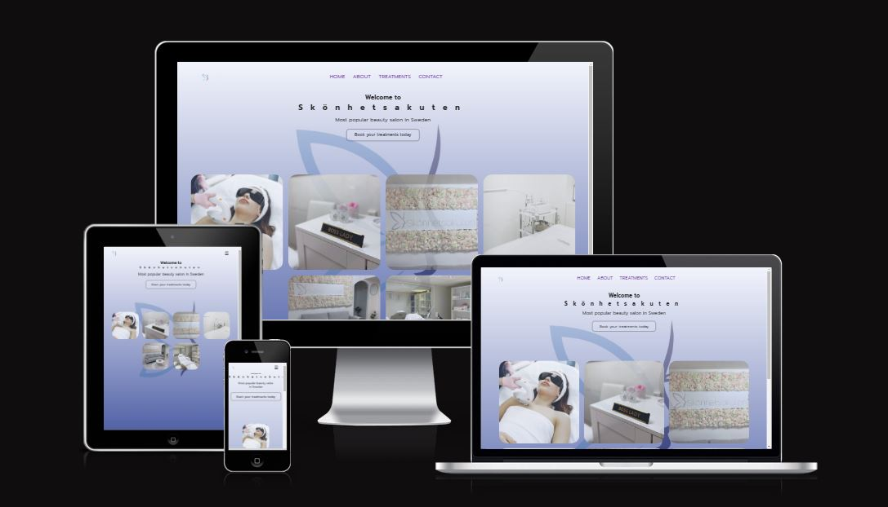
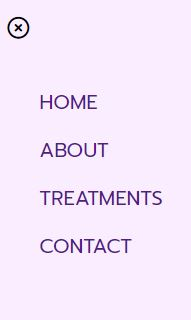

## Skönhetsakuten
Welcome to Skönhetsakuten – your one-stop solution for hassle-free scheduling and information access for a wide range of treatments, including services like lash extensions, hair removal, teeth whitening, and more. The website is designed to simplify the process of booking appointments and addressing inquiries related to these treatments, providing a seamless experience for both customers and service providers.

## The Problem It solves
Traditionally, customers interested in booking treatments often encountered hurdles like lengthy phone calls, back-and-forth emails, and the need to physically visit a salon or clinic to secure an appointment. Additionally, they frequently had unanswered questions regarding the treatments. This project addresses these issues by offering an online platform that empowers customers to book appointments effortlessly and seek clarity on any aspect of their chosen treatments. The platform's user-friendly design ensures that finding essential information, including treatment details, pricing, and appointment availability, is a breeze. This streamlines the customer experience, making it more efficient, accessible, and satisfying for everyone involved.

## Features

- Navigation bar
Navigation bar – The website features a user-friendly navigation bar, offering easy access to essential sections, including Home, About, Treatments, and Contact. This intuitive navigation ensures that users can swiftly explore the website and find the information they need.
This streamlines the customer experience, making it more efficient, accessible, and satisfying for everyone involved.

Notably, the navigation bar is thoughtfully customized for mobile phones, providing an equally seamless experience for users on smaller screens. Whether you're using a desktop or a mobile device, the navigation bar is designed for optimal usability and accessibility.

