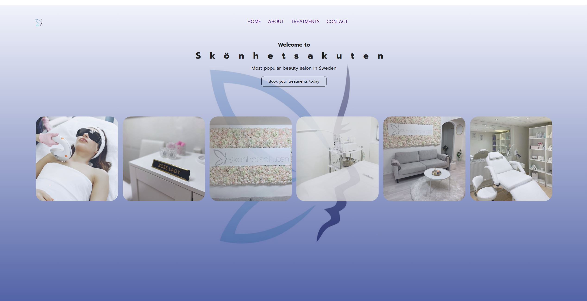
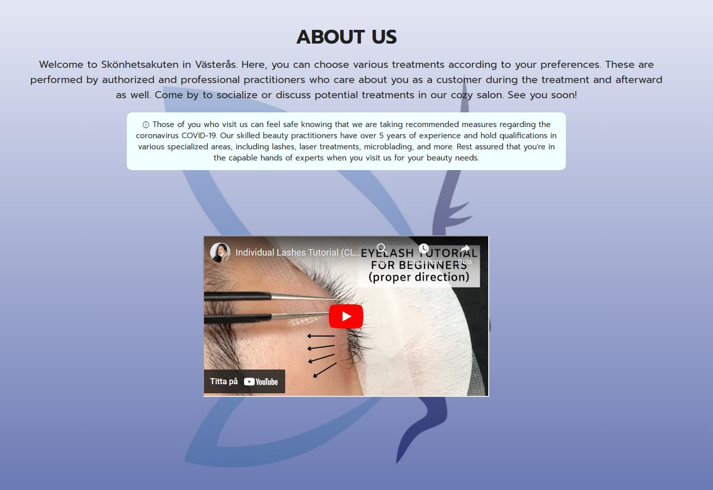
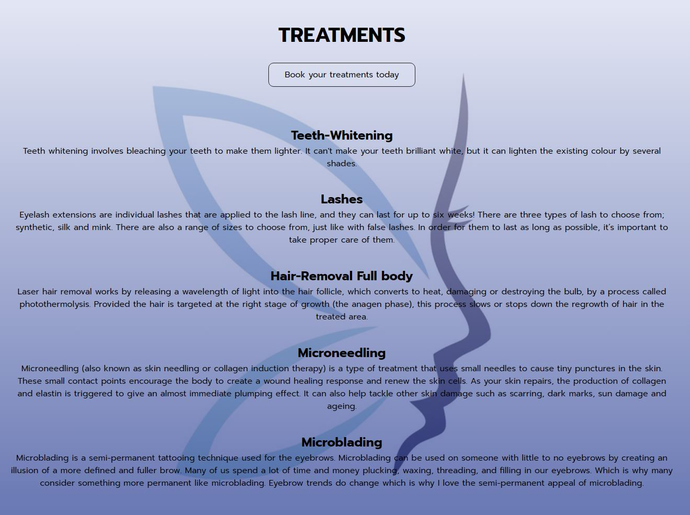
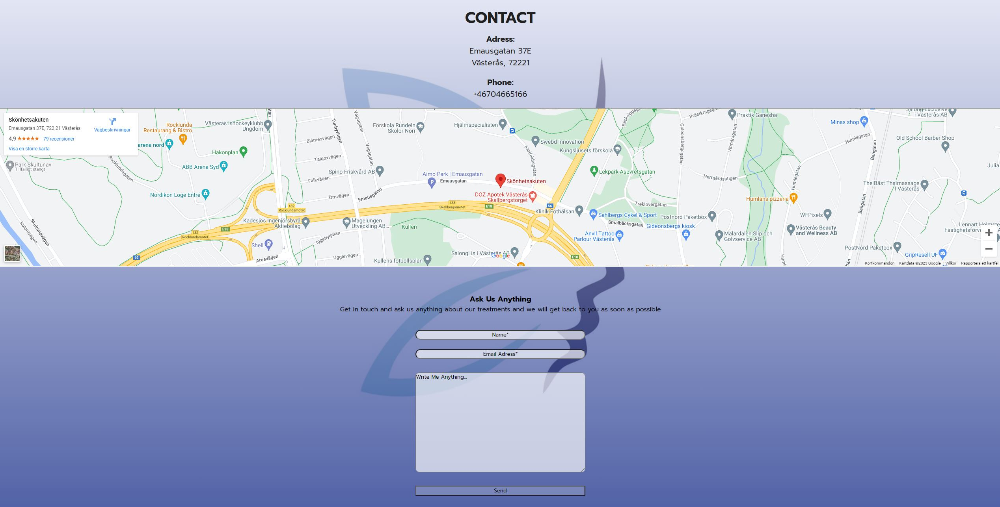
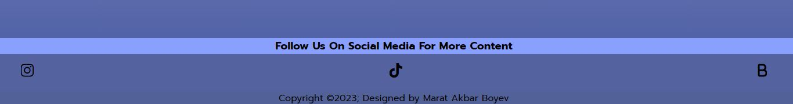
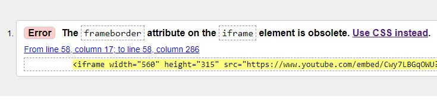

## Skönhetsakuten
Welcome to Skönhetsakuten – your one-stop solution for hassle-free scheduling and information access for a wide range of treatments, including services like lash extensions, hair removal, teeth whitening, and more. The website is designed to simplify the process of booking appointments and addressing inquiries related to these treatments, providing a seamless experience for both customers and service providers.

## The Problem It solves
Traditionally, customers interested in booking treatments often encountered hurdles like lengthy phone calls, back-and-forth emails, and the need to physically visit a salon or clinic to secure an appointment. Additionally, they frequently had unanswered questions regarding the treatments. This project addresses these issues by offering an online platform that empowers customers to book appointments effortlessly and seek clarity on any aspect of their chosen treatments. The platform's user-friendly design ensures that finding essential information, including treatment details, pricing, and appointment availability, is a breeze. This streamlines the customer experience, making it more efficient, accessible, and satisfying for everyone involved.

## Features

- Navigation bar
Navigation bar – The website features a user-friendly navigation bar, offering easy access to essential sections, including Home, About, Treatments, and Contact. This intuitive navigation ensures that users can swiftly explore the website and find the information they need.
This streamlines the customer experience, making it more efficient, accessible, and satisfying for everyone involved.

Notably, the navigation bar is thoughtfully customized for mobile phones, providing an equally seamless experience for users on smaller screens. Whether you're using a desktop or a mobile device, the navigation bar is designed for optimal usability and accessibility.

- Home section
The "Home" section serves as the welcoming gateway to the website, providing customers with a visually appealing introduction to the salon and the convenience of booking appointments for a wide range of treatments. To offer customers a better understanding of what the salon is all about, pictures of the facility are included, showcasing the serene and inviting atmosphere where the treatments take place. These images provide a sneak peek into the ambiance, cleanliness, and comfort the customer can expect.
There is an external link that allows customers to book appointments for their desired treatments with just a click. This link seamlessly connects the customers to the appointment booking platform, making the process of scheduling treatments a breeze.

- About
The "About" section offers an in-depth look into the salon. A featured video provides a firsthand view of the work, highlighting the expertise and care that goes into every treatment that offers. In this section outlines the comprehensive precautions that are taken to ensure a hygienic and secure environment for both customers and staff. Additionally, the customer can explore the essence of the salon, from its history to the mission, and get to know the dedicated team that makes the commitment to exceptional service a reality. "About" is the place where the customer can connect with the heart of the establishment.

- Treatments
In this section, the customers will find comprehensive information about each treatment that is offered. There is provided details about the procedure, expected results, pricing, and any special considerations. To make customers experience seamless, there is also an included external link button for booking each treatment. This button allows the customers to easily schedule appointments for their chosen treatments, ensuring that they can access the services with convenience and efficiency.

- Contact
The "Contact" section is designed to provide with easy access to the salon and the assistance that the customer may need. In this section there is a map, offering clear guidance to locate the salon. The address is readily available, ensuring an easily note of the location and plan the visit with confidence. This section also includes phone number.
To make reaching out even more convenient, there is an included contact form. This form allows to send messages directly, providing a convenient channel for reaching the team

- Footer
The footer section includes quick links for staying connected and accessing additional information. Visitors can find links to their TikTok and Instagram profiles for more media and updates. For the utmost convenience in scheduling appointments, there is a direct link to "Bokadirekt," allowing users to book treatments seamlessly. The footer serves as a hub for visitors to stay engaged with the salon, keep up with the latest updates, and ensure smooth and efficient appointment booking.

# Tests
In preparing this project, extensive testing was conducted to ensure that all its features are functioning as intended, providing users with a seamless and efficient experience. The testing process covered a range of aspects, including functionality, compatibility, and visual design.

## Validator Tests

- HTML
Error “ The frameborder attribute on the iframe element is obsolete. Use CSS instead “ were returned when passing through the official W3C validator. An easy fix was to delete the “frame border=0”.

- CSS
No errors were found when passing through the official (Jigsaw) validator.

## Deployment

The website has been deployed on GitHub Pages. The deployment process involves the following steps:

- Go to the "Settings" tab within your GitHub repository

- In the "Source" section, select the "Master Branch" from the drop-down menu

- After selecting the master branch, the page will automatically refresh, and you will see a ribbon display indicating the successful deployment

The live link can be found here - https://mabswe.github.io/Skonhetsakuten/index.html

# Credits

## Content
* Instructions on how to implement form validation on the "Contact" page was taken from [This Youtube Video](https://youtu.be/E5MEzC0prd4?si=4RoqkRT1HJv6EUEK)
* Inspiration on how to make responsive images was taken from [This Youtube Video](https://www.youtube.com/watch?v=QmZNFnqwu74&list=PLdwoDZXm0vRN_McH2ZSxvSyX2u49zsZFm&index=3)
* The icons in the footer and the navigation bar on smaller screen, were taken from [Fontawsome](https://fontawesome.com/)
* The map in the “Contact” page was taken from [Google Maps](https://www.google.com/maps)

## Media
* The four images used in the home section where all taken by the developer, the other two were taken from [Pexels](https://www.pexels.com)
* The video shown in the “About” section is taken [Youtube](https://youtu.be/Cwy7LBGqOWU?si=ec37eBBoYzS9slwr), which is a open source site
* The favicon, image on the top-left and the background image are creation and belong to the company

## Thanks
* Rahul Lakhanpal: Code Institute Mentor.\
Grateful for my mentor's invaluable guidance and support throughout the project. Thank you for your unwavering assistance and expertise.

* David Calikes: Code Institute Cohort Facilitator.\
Thanks David, for being a steadfast supporter during my challenges. Your unwavering encouragement meant a lot and made a difference.

* The Slack Community\
Gratitude to the supportive Slack Community for answering my questions and helping me overcome barriers. Your assistance was invaluable. Thank you!
